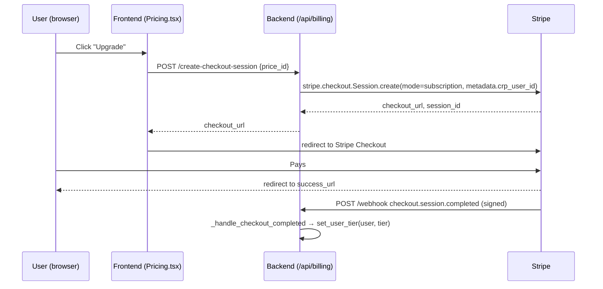

# CRP Comply — Payment & Tier-Purchase Workflow Analysis

> **Question answered:** *"What happens when a user tries to buy a tier — is the payment
> workflow correct, or does it have gaps?"*
> **Verdict:** The happy path is correct and well-structured (Stripe Checkout →
> signed webhook → tier activation). But there are **seven real gaps** between "Stripe took
> the money" and "the user reliably has the entitlement they paid for." None are catastrophic;
> all are fixable. The two that can actually lose a paying customer their access are **(G1)
> webhook idempotency** and **(G5) the frontend assuming success before the server confirms.**

---

## 1. The tiers (and a naming inconsistency to fix first)

There are **three** different tier tables in the repo and they do **not** agree:

| Source | Tiers & prices |
|---|---|
| `STRIPE_MONETISATION.md` | Free $0 · **Pro $149** · **Enterprise $699** · **Cloud $1,999** |
| `frontend/src/pages/Pricing.tsx` | Free · **Starter $49** · **Professional $199** · **Business $599** |
| `docs/LLM_HOSTING.md` | Free $0 · **Starter $49** · **Pro $199** · **Enterprise $599+** |

**Gap G0 (cosmetic but commercial):** a customer reading the marketing page sees `$49 / $199 /
$599`, but the Stripe price catalogue in `STRIPE_MONETISATION.md` lists `$149 / $699 / $1,999`.
If the live Stripe Price IDs follow the monetisation doc, **the page price and the charged price
differ** — a chargeback/abuse risk and a trust problem. **Action: pick one canonical price
table, make `PRICE_TO_TIER` and the frontend read from the same source of truth.**

---

## 2. The happy path (what works)

This is the **correct shape**: tier state is granted **server-side from the signed webhook**,
not from the browser redirect. Subscription lifecycle events are all wired:
`checkout.session.completed`, `invoice.paid`, `invoice.payment_failed`,
`invoice.payment_action_required`, `customer.subscription.updated`,
`customer.subscription.deleted`, `payment_intent.succeeded`. A **Stripe Customer Portal**
session (`/create-portal-session`) gives self-service invoices / card update / cancel.

---

## 3. The gaps (ranked by customer impact)

### G1 — No webhook idempotency (HIGH — can double-grant or race)
`_handle_checkout_completed`, `grant_usd` (credit packs), and tier setters have **no processed-
event store**. Stripe **will** redeliver events (it retries, and at-least-once delivery is its
contract). Today a redelivered `payment_intent.succeeded` calls `grant_usd()` **again** →
double credits; a redelivered `checkout.session.completed` re-sets the tier and can race a
concurrent `subscription.updated`.
**Fix:** persist `stripe_event.id` in a small table/Redis set; at the top of `/webhook`,
`if event.id in processed: return 200` then mark processed inside the same transaction as the
entitlement write. Use Stripe **idempotency keys** on outbound calls too.

### G2 — Failed payment never revokes access (MEDIUM)
`_handle_payment_failed` only logs `"Stripe will retry"`. If dunning exhausts, the only thing
that downgrades the user is `customer.subscription.deleted`. Between first failure and final
cancellation (days), the user keeps full paid quota for free.
**Fix:** on `invoice.payment_failed`, move the tenant to a **`past_due`** state that warns in-app
and (after N failures or on `payment_action_required`) soft-limits to Free quota. Send a
"update your card" email/portal link.

### G3 — No dead-letter / reconciliation if a webhook is lost (MEDIUM)
Stripe retries for ~3 days; if all retries fail (backend down, deploy window), **the user paid
but never got the tier, and there is no record of the gap.**
**Fix:** add a nightly **reconciliation job**: list active Stripe subscriptions, compare to
stored tiers, and repair drift. Log every webhook receipt to an audit table so support can see
"paid at T, tier granted at T+Δ (or never)."

### G4 — Downgrade/cancellation is immediate and mid-flight unsafe (LOW–MEDIUM)
`customer.subscription.deleted` drops the tenant straight to FREE with no grace period. A user
mid-request can have quota yanked under them.
**Fix:** honour Stripe's `current_period_end` — keep entitlements until the paid period actually
ends (`cancel_at_period_end`), rather than dropping on the delete event.

### G5 — Frontend assumes success before the server confirms (MEDIUM — UX/trust)
After the Stripe redirect to `success_url`, the UI shows "upgraded" **without polling the backend
for the entitlement.** If the webhook is slow or fails, the user sees success but is still on the
old tier (and later silently loses features).
**Fix:** the success page should **poll `GET` the user's tier** (or a `GET /billing/session/{id}`
that verifies with Stripe) and only show "active" once the server confirms. Show a "finalising…"
state meanwhile.

### G6 — No receipt/lifecycle email from the app (LOW)
Receipts rely entirely on Stripe. There is no app-side "welcome to Pro / here's how to connect
your LLM" onboarding email — a missed activation moment (see the business-model doc).
**Fix:** send a post-activation email that links straight to the **Connect LLM** setup step.

### G7 — Credit-pack grant has no transactional guard (HIGH, same root as G1)
`grant_usd()` adds to balance every call with `reason="stripe:{price}:{pi}"` but no uniqueness
constraint on that reason. A redelivered `payment_intent.succeeded` double-grants credits.
**Fix:** make the grant **idempotent on the payment_intent id** (unique constraint / upsert).

---

## 4. Post-purchase: does the app reflect the new plan?

- **Feature gating:** yes — the UI renders tier-specific features and `model_router.py`
  gates hosted routing to `{pro, business, enterprise}`; Free/Starter stay BYOK/local.
- **Usage:** quota is enforced per proxy call (`api/usage.py`), with overage metered to Stripe
  when `STRIPE_METER_EVENT_NAME` is set.
- **Reflection timing:** the dashboard reflects the new tier **only after the webhook lands** —
  which is exactly why **G5** matters.

---

## 5. Priority fix list (smallest change, biggest protection)

| # | Fix | Effort | Protects |
|---|-----|--------|----------|
| 1 | Webhook **idempotency store** (G1, G7) | S | Double-charge/credit, races |
| 2 | Success page **polls server** before showing "active" (G5) | S | "I paid and got nothing" |
| 3 | **Reconciliation job** + webhook receipt audit (G3) | M | Lost-webhook silent failures |
| 4 | `past_due` state on payment failure (G2) | M | Revenue leak / abuse |
| 5 | Honour `cancel_at_period_end` (G4) | S | Mid-flight downgrade UX |
| 6 | **Single canonical price table** (G0) | S | Page-vs-charge mismatch |
| 7 | Activation email → Connect-LLM (G6) | S | Activation / churn |

---

*Licensed under the Elastic License 2.0 — see LICENSE.md for details.*
